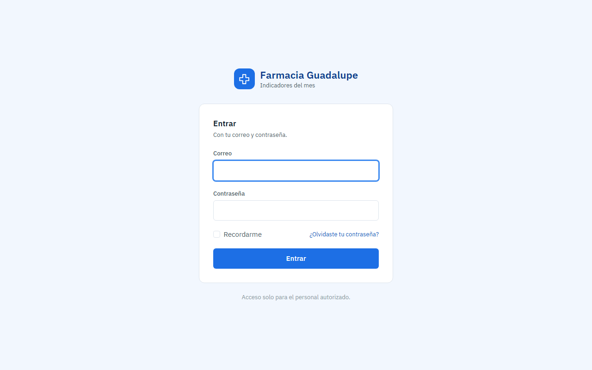
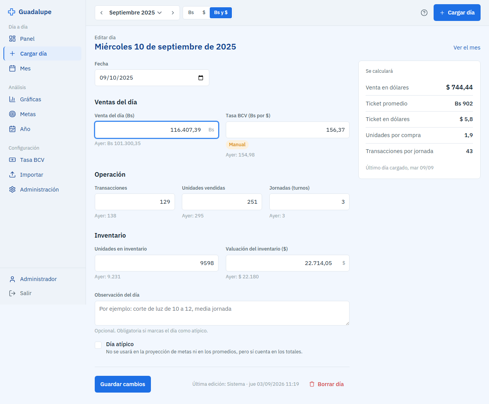
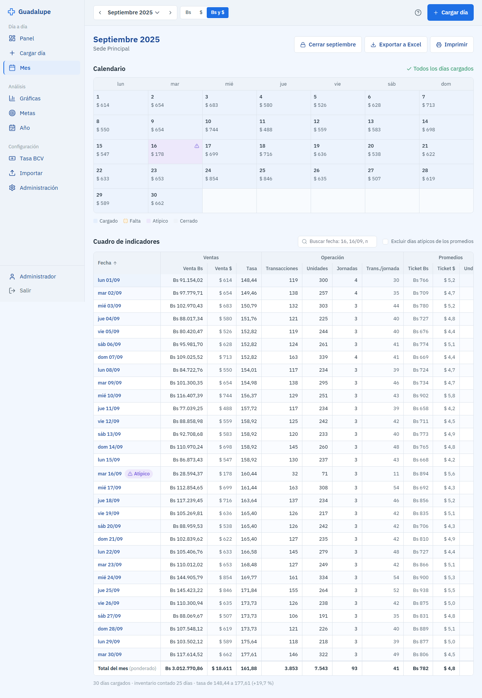
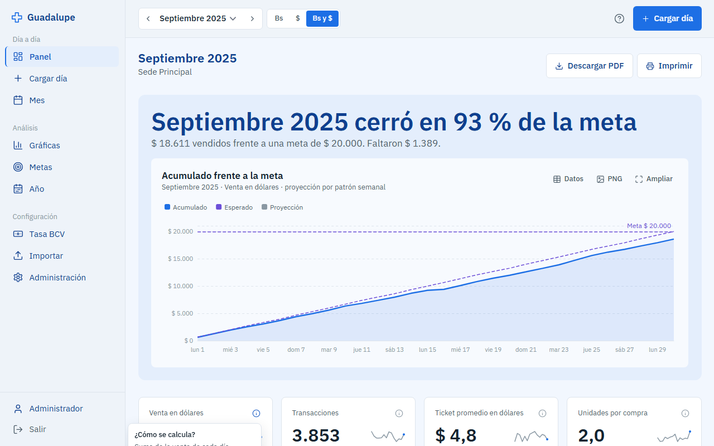
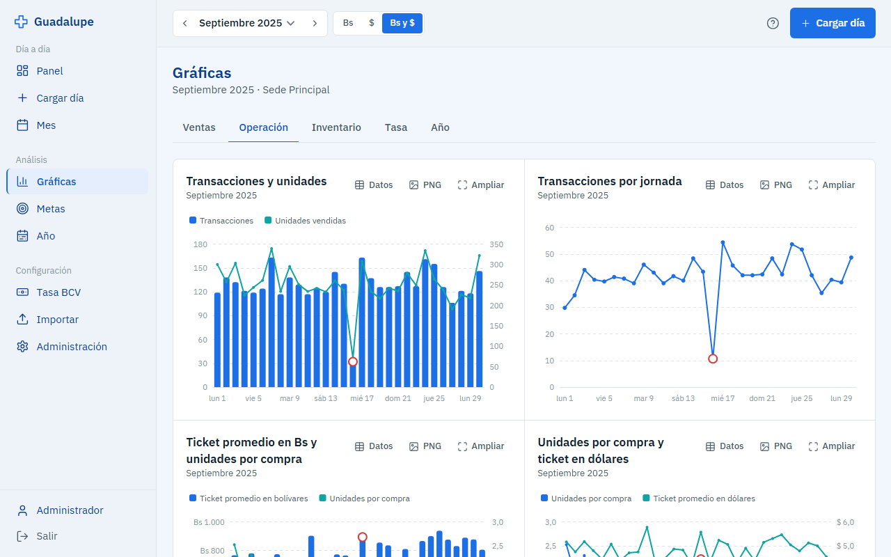
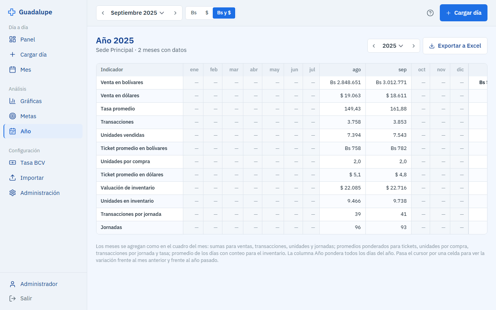
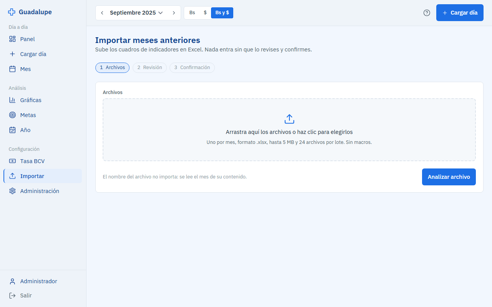
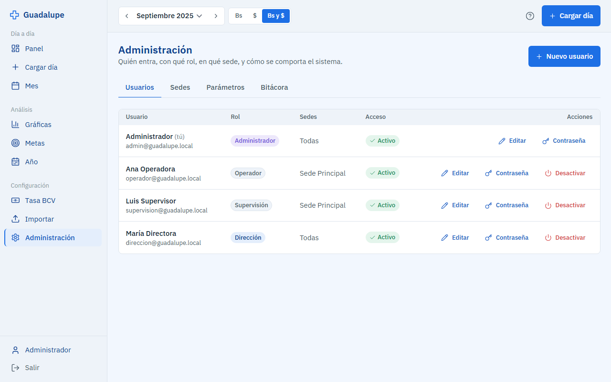

# Manual breve — Indicadores Farmacia Guadalupe

Qué hace cada pantalla y cómo se usa en el día a día. Dentro del sistema, el botón **?** de la barra superior abre la ayuda de la pantalla en la que estás, con las fórmulas de cada indicador y el glosario.

## Entrar

Abre la dirección del sistema, escribe tu correo y tu contraseña y pulsa **Entrar**. Si el administrador te dio una contraseña temporal, cámbiala en **Perfil** (abajo a la izquierda). Si la olvidaste, usa "¿Olvidaste tu contraseña?" y llegará un correo.

Según tu rol entras en una pantalla distinta: el operador aterriza en **Mes**; supervisión y dirección, en el **Panel**.

## Cargar el día

Es lo que se hace cada día. **Cargar día** (menú, botón azul o `Alt + N`) abre el primer día del mes que falta.

1. Revisa la fecha y el día de la semana.
2. Escribe la **venta en bolívares**. La **tasa BCV** ya viene propuesta (si es fin de semana, se arrastra la última publicada); solo cámbiala si tienes una distinta.
3. Escribe **transacciones**, **unidades vendidas** y **jornadas**.
4. Los días con conteo aparece **Inventario**: unidades y valuación en dólares.
5. A la derecha ves lo que se calculará: venta en dólares, ticket promedio, unidades por compra y transacciones por jornada.
6. Pulsa **Guardar día**. El sistema pasa al siguiente día que falte.

Las advertencias en ámbar (una venta muy distinta, una tasa que salta) no bloquean: revisa el dato o pulsa **Guardar de todos modos**.

Si la farmacia no abrió ese día, usa **Registrar como día cerrado** con el motivo. Si el día fue raro (corte de luz, media jornada), marca **Día atípico** y escribe la observación: cuenta en los totales, pero no en los promedios ni en la proyección. Puedes deshacerlo desde el aviso durante unos segundos.

Lo que escribes queda guardado en tu navegador hasta que el día se guarde: si se cierra la pestaña o vence la sesión, al volver lo recuperas.

## Mes

El calendario muestra cada día con su estado: cargado, falta, atípico, cerrado. Haz clic en un día para cargarlo o corregirlo; **Cargar los N faltantes** los recorre en orden.

Debajo está el **cuadro de indicadores**, igual al del Excel, con la fila de totales ponderados al pie. Haz clic en un encabezado para ordenar y usa el buscador para ir a una fecha ("16", "16/09" o "mar"). **Excluir días atípicos** recalcula los promedios sin ellos. **Exportar a Excel** descarga el libro con las hojas Indicadores, Anual y Tasas; **Imprimir** prepara la página para papel.

Cuando el mes está completo, supervisión o dirección lo **cierra**: queda en solo lectura y nadie lo edita sin reabrirlo con un motivo. Todo queda en el historial del mes.

## Panel

El estado del mes de un vistazo:

- Arriba, cuánto va frente a la **meta** y cómo cerraría al ritmo actual.
- Cuatro tarjetas principales (venta en dólares, transacciones, ticket promedio, unidades por compra) con la variación frente al mes anterior. La **ⓘ** de cada tarjeta explica cómo se calcula y muestra el último día.
- "Ver 4 indicadores más" despliega venta en bolívares, unidades, transacciones por jornada e inventario.
- La venta diaria y el mapa de calor por día de la semana.
- Los avisos del mes: días sin cargar, tasa arrastrada, mes anterior sin cerrar.

**Descargar PDF** arma el reporte del mes con las gráficas que ves en pantalla.

## Gráficas

Las mismas gráficas del Excel por familia: **Ventas**, **Operación**, **Inventario**, **Tasa** y **Año**. En cada una: **Datos** muestra la tabla, **PNG** la descarga y **Ampliar** la abre a pantalla completa. La pestaña Año compara cada mes con el año anterior para el indicador que elijas.

## Metas

Una meta por indicador y mes. En **Este mes** se editan en línea y se ve el avance, lo esperado a la fecha y la proyección de cierre en verde, ámbar o rojo. En **Año** se editan los doce meses de una vez: se puede copiar el año anterior, aplicar un porcentaje a toda la fila o pegar desde Excel.

## Año

La tabla anual del Excel: doce meses y la columna del año. Pasa el cursor por una celda para ver la variación frente al mes anterior y frente al año pasado. Se exporta a Excel.

## Barra superior

Todas las pantallas responden al mes, la sede y la moneda que eliges arriba. La moneda cambia qué se muestra en grande (Bs, $ o ambas).

## Tasa BCV

La tasa se consulta sola dos veces al día. En esta pantalla se ve cada día con su origen (BCV, manual o arrastrada), se corrige a mano y, si hace falta, se **recalcula el mes** con la tasa corregida (el sistema muestra antes cuántos días cambiarían).

## Importar

Para traer los cuadros anteriores en Excel. Sube uno o varios archivos, revisa lo que el sistema encontró (días faltantes, duplicados, ventas muy distintas, un mes ya cargado) y decide en cada caso. Nada entra sin confirmar.

## Administración

Solo el administrador: **usuarios** (crear, rol, sede, desactivar, contraseña), **sedes**, **parámetros** (advertencias, metas, correo) y la **bitácora**, que cuenta quién hizo qué y cuándo.

## Atajos

| Tecla | Acción |
|---|---|
| `Alt + N` | Cargar día |
| `?` | Ayuda de la pantalla |
| `Enter` | Guardar el formulario |
| `Esc` | Cerrar ventanas y paneles |
| Flechas | Moverse por el calendario y por la cuadrícula de metas |

## Roles

| Rol | Puede |
|---|---|
| Operador | Cargar y corregir los días recientes de su sede |
| Supervisión | Además: corregir cualquier día, borrar, marcar atípicos, cerrar el mes, metas, tasa, importar |
| Dirección | Además: reabrir meses y ver todas las sedes |
| Administrador | Todo, más usuarios, sedes y parámetros |
